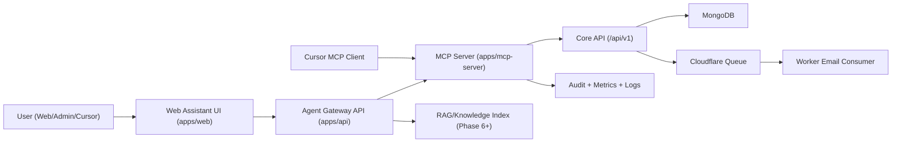

# MCP Implementation Roadmap

## 1. Goal

Build a production-ready AI + MCP capability in this monorepo that supports:

1. Safe read/write operations for internal workflows (blogs/projects/ops).
2. A web assistant experience in your portal (`/assistant`) for controlled actions.
3. Enterprise-grade controls: auth, approvals, audit logs, observability, staged rollout.

## 2. Scope

### In Scope

1. MCP server and tool ecosystem in `apps/mcp-server`.
2. Agent gateway APIs in `apps/api` for web chat orchestration.
3. Frontend assistant UI in `apps/web`.
4. Governance for mutation tools (draft/update/publish/delete).
5. Monitoring, testing, and staged deployment.

### Out of Scope (Initial)

1. Public anonymous AI access.
2. Unrestricted production write actions without confirmation.
3. Multi-tenant enterprise IAM integration (deferred phase).

## 3. Current Baseline (As-Is)

### Already Implemented

1. MCP server scaffold in `apps/mcp-server`.
2. Tooling currently available:
   1. `blogs_create_draft`
   2. `blogs_list_recent`
   3. `blogs_publish_blog` (flag-gated)
3. Shared MCP constants/types in:
   1. `packages/constants/src/index.js`
   2. `packages/constants/src/index.d.ts`
   3. `packages/types/src/mcp/index.ts`
4. Token-based server-to-API invocation with request-id and idempotency headers.

### Gaps

1. No web chat endpoint in API (`/api/v1/agent/chat`).
2. No `/assistant` UI in web.
3. No two-step approval workflow for sensitive writes.
4. No dedicated MCP call audit model (tool-level trail).
5. No retrieval layer (RAG) for long-form knowledge grounding.
6. No remote MCP transport deployment plan (currently stdio-focused).

## 4. Target Architecture

## 5. Principles

1. MCP is a control plane, not a data store.
2. Browser never receives service tokens.
3. Mutations require explicit guardrails (idempotency + approval + audit).
4. Stage-first rollout; production writes gated.
5. Every action traceable with correlation IDs.

## 6. Phased Roadmap

## Phase 0: Stabilize MCP Foundation (Effort: 2-3 days, Parallel Track A)

### Objectives

1. Complete safe blog toolset and improve local reliability.

### Deliverables

1. Add tools:
   1. `blogs_get_by_id_or_slug`
   2. `blogs_update_draft`
   3. `blogs_delete_draft` (only when `status=draft`)
2. Standard error envelope for all tools.
3. Consistent tool result schema in shared types.

### Acceptance Criteria

1. `pnpm --filter mcp-server check` and `pnpm --filter mcp-server build` pass.
2. All tools callable from Cursor and return deterministic output.
3. `delete` blocked for published/archived blogs.

## Phase 1: Agent Gateway API (Effort: 3-4 days, Parallel Track B)

### Objectives

1. Create server-side orchestration layer for web assistant.

### Deliverables

1. New API routes in `apps/api`:
   1. `POST /api/v1/agent/chat` (streaming output preferred)
   2. `POST /api/v1/agent/plan`
   3. `POST /api/v1/agent/confirm` (for sensitive actions)
2. Tool dispatcher service that invokes MCP tool layer.
3. Request context propagation (`x-request-id`, actor metadata).

### Acceptance Criteria

1. Gateway can perform at least one read tool and one draft write tool.
2. No secrets exposed in API responses.
3. Integration tests run in CI for chat route and one mutation path.

## Phase 2: Web Assistant UI (Effort: 2-4 days, Parallel Track C)

### Objectives

1. Add practical assistant experience to portfolio web app.

### Deliverables

1. `/assistant` page in `apps/web`.
2. Chat components:
   1. message stream
   2. tool action cards
   3. confirmation modal for sensitive actions
3. Role-aware UI behavior (admin-only actions shown conditionally).

### Acceptance Criteria

1. End-to-end chat works: web -> API gateway -> tool -> API -> response.
2. Tool actions and results are visible and understandable.

## Phase 3: Approval Workflow + Policy Engine (Effort: 2-3 days, Critical Path)

### Objectives

1. Prevent accidental destructive writes.

### Deliverables

1. Policy map:
   1. read tools = auto
   2. draft write tools = auto for admin/editor
   3. publish/delete tools = confirm required
2. Signed confirmation token with short TTL.
3. Enforced `dryRun` path for sensitive commands.

### Acceptance Criteria

1. `publish` and `delete` fail without confirmation token.
2. Approvals are single-use and expire by TTL.

## Phase 4: Audit and Compliance Layer (Effort: 2-3 days, Critical Path)

### Objectives

1. Full traceability for interviews and real operations.

### Deliverables

1. MCP-specific audit model (or extend existing audit log):
   1. actor
   2. toolName
   3. inputHash
   4. requestId/correlationId
   5. outcome/statusCode
2. Log redaction strategy for sensitive fields.
3. Dashboard query snippets/runbook for incident triage.

### Acceptance Criteria

1. Every tool invocation creates an audit record.
2. Logs can trace from UI request -> MCP tool -> API write.

## Phase 5: Security and Reliability Hardening (Effort: 2-3 days, Critical Path)

### Objectives

1. Make MCP production-safe.

### Deliverables

1. Strict per-environment tokens:
   1. local
   2. stage
   3. prod
2. Remove legacy token fallback in stage/prod path.
3. Add rate limiting and timeout budgets at gateway and MCP layers.
4. Circuit breaker around upstream API tool calls.

### Acceptance Criteria

1. Stage/prod cannot boot without explicit MCP token.
2. Retries do not duplicate writes (idempotency validated).

## Phase 6: Knowledge Retrieval (RAG, Post-MVP) (Effort: 4-7 days, Optional Track)

### Objectives

1. Ground assistant responses on your own content.

### Deliverables

1. Index content sources:
   1. blogs
   2. projects
   3. staff review docs
2. Retrieval API for top-K citations.
3. Response format with source references.

### Acceptance Criteria

1. Assistant answers include citations for non-trivial claims.
2. Retrieval latency within defined budget.

## Phase 7: Remote MCP Transport (Effort: 3-5 days, Post-MVP)

### Objectives

1. Support team/shared usage beyond local stdio.

### Deliverables

1. Streamable HTTP transport mode for `apps/mcp-server`.
2. Auth middleware for remote MCP access.
3. Deploy plan (Fly or equivalent) with stage/prod configs.

### Acceptance Criteria

1. Remote MCP endpoint serves same tool set with auth enforced.
2. Local stdio mode still supported for Cursor development.

## Phase 8: Production Rollout and SLOs (Effort: 2-3 days + 48h observation window)

### Objectives

1. Controlled go-live with measured reliability.

### Deliverables

1. Release sequence:
   1. read-only tools in prod
   2. draft write tools
   3. publish with approval
2. Rollback runbook and error budget policy.
3. Alerting thresholds for tool failure rate/latency spikes.

### Acceptance Criteria

1. No sev-1 incidents in first rollout window.
2. SLO reports available weekly.

## 6.1 Sequencing Strategy (Parallel vs Critical)

### Parallel Tracks (Start Immediately)

1. Phase 0 (MCP tool expansion)
2. Phase 1 (API gateway)
3. Phase 2 (assistant UI with mocked backend first)

### Critical Path (Must Be Sequential)

1. Phase 3 (approval/policy) -> Phase 4 (audit/compliance) -> Phase 5 (hardening) -> Phase 8 (production rollout)

### Post-MVP Tracks

1. Phase 6 (RAG grounding)
2. Phase 7 (remote MCP transport)

Execution rule:

1. Do not enable production write actions until Phases 3-5 are complete and validated in stage.

## 7. Environment and Secrets Matrix

| Environment | MCP Token Source                                   | Publish Enabled        | Notes                |
| ----------- | -------------------------------------------------- | ---------------------- | -------------------- |
| local       | `apps/mcp-server/.env` or `apps/api/.env` fallback | `false` by default     | fast iteration       |
| stage       | explicit `MCP_API_BEARER_TOKEN`                    | `false` initially      | test approvals first |
| prod        | explicit scoped token only                         | `false` until sign-off | no legacy fallback   |

Required variables:

1. `MCP_API_BASE_URL`
2. `MCP_API_BEARER_TOKEN`
3. `MCP_ACTOR_ID`
4. `MCP_API_TIMEOUT_MS`
5. `MCP_ALLOW_BLOG_PUBLISH`
6. `AGENT_GATEWAY_ENABLED` (recommended feature flag)

## 8. Testing Strategy

### Unit

1. Tool schema validation tests.
2. API client error mapping tests.
3. Policy decision tests (`allow`, `deny`, `confirm-required`).

### Integration

1. MCP tool -> API endpoint (local env).
2. Idempotency behavior on repeated mutation calls.
3. Publish flow with and without confirmation.

### End-to-End

1. `/assistant` prompt -> tool call -> blog draft created.
2. Draft -> approval -> publish -> verification.
3. Failure simulation (token invalid, API timeout, queue failure).

### Load and Concurrency

1. Baseline test: 10 concurrent chat sessions for 10 minutes (mixed read/write prompts).
2. Stress test: 25 concurrent sessions for 5 minutes to identify saturation points.
3. Validate p95 latency and error rate against SLO targets.
4. Verify duplicate-write prevention under retries (idempotency in concurrent conditions).

## 9. Observability and KPIs

Track at minimum:

1. Tool call success rate.
2. Tool latency p50/p95/p99.
3. Mutation rejection reasons (`policy`, `auth`, `validation`).
4. Approval conversion rate.
5. End-to-end trace completion rate (`requestId` continuity).

Target initial SLOs:

1. Read tool success >= 99.5%.
2. Mutation success >= 99.0% (excluding policy-denied).
3. p95 tool latency <= 1200ms (local/stage baseline may vary).

## 10. Risk Register and Mitigations

| Risk                                 | Impact | Mitigation                                                                  |
| ------------------------------------ | ------ | --------------------------------------------------------------------------- |
| Token leakage                        | high   | server-side secrets only, no frontend exposure                              |
| Unsafe write execution               | high   | approval tokens + policy engine + tool allowlist                            |
| Duplicate writes on retry            | medium | mandatory idempotency keys                                                  |
| Hallucinated tool input              | medium | strict zod schemas + bounded enums                                          |
| Environment drift                    | medium | explicit stage/prod secret contracts                                        |
| Poor debuggability                   | medium | requestId propagation + audit model                                         |
| Queue/provider outage (email/events) | medium | circuit breaker + async retry + read-only fallback for non-critical actions |

## 11. Execution Board (Action Checklist)

1. [ ] Add MCP tool extensions in `apps/mcp-server/src/index.ts`.
2. [ ] Add corresponding contracts in `packages/types/src/mcp/index.ts`.
3. [ ] Build API gateway routes under `apps/api/src/routes`.
4. [ ] Add agent services under `apps/api/src/services`.
5. [ ] Implement `/assistant` UI in `apps/web/src/app`.
6. [ ] Add approval token service and validation middleware.
7. [ ] Add MCP audit model + persistence.
8. [ ] Add stage deployment and smoke tests.
9. [ ] Add production canary rollout steps.

## 12. Definition of Done

This roadmap is complete when:

1. Users can chat in `/assistant` and perform safe blog operations.
2. Publish/delete are blocked without explicit approval.
3. Every tool call is auditable and traceable.
4. Stage and prod are separated by credentials and policy.
5. Runbooks and SLO dashboards are documented and used.

## 13. Repo Task Matrix (What Goes Where)

| Area             | Responsibilities                                                 | Primary Paths                                                                                    |
| ---------------- | ---------------------------------------------------------------- | ------------------------------------------------------------------------------------------------ |
| MCP Tooling      | Tool schemas, tool handlers, API client, transport mode          | `apps/mcp-server/src`                                                                            |
| Shared Contracts | Tool names, headers, request/response contracts                  | `packages/constants/src`, `packages/types/src/mcp`                                               |
| API Gateway      | Agent routes, policy decisions, approval flow, audit persistence | `apps/api/src/routes`, `apps/api/src/services`, `apps/api/src/middleware`, `apps/api/src/models` |
| Web Assistant    | Chat UX, tool cards, confirm modals, role-aware action controls  | `apps/web/src/app`, `apps/web/src/components`                                                    |
| Operations       | env templates, CI gates, rollout scripts, runbooks               | `.env.example`, `.github/workflows`, root scripts                                                |

## 14. First 10 PRs (Practical Delivery Sequence)

1. `feat(mcp): add blog read/update/delete draft tools`
2. `feat(types): extend mcp contracts for new tool schemas`
3. `feat(api): add /api/v1/agent/chat and /api/v1/agent/confirm`
4. `feat(api): add policy engine for sensitive tool execution`
5. `feat(api): add mcp audit model + request correlation persistence`
6. `feat(web): add /assistant page with streaming chat UI`
7. `feat(web): add confirmation modal for publish/delete actions`
8. `feat(api): add approval token service + TTL + single-use validation`
9. `chore(obs): add mcp success/failure/latency metrics and alerts`
10. `chore(release): stage canary rollout + production read-only launch`

Each PR should include:

1. contract updates (`packages/types` and `packages/constants` when relevant)
2. unit tests
3. one integration test for changed path
4. docs update in this roadmap or runbook

## 15. Command Runbook (Local -> Stage -> Prod)

### Local Development

1. `pnpm --filter @fullstack-lab/types build`
2. `pnpm mcp:dev`
3. `pnpm --filter node-backend dev`
4. `pnpm web:dev`

### Local Validation

1. call MCP tools from Cursor (`blogs_list_recent`, `blogs_create_draft`, etc.)
2. verify API logs carry `x-request-id`
3. verify idempotent write behavior by retrying same request key

### Stage Deployment

1. deploy API stage (`pnpm api:deploy:stage`)
2. deploy web stage (`pnpm web:stage`)
3. set stage MCP token and flags (`MCP_API_BEARER_TOKEN`, `MCP_ALLOW_BLOG_PUBLISH=false`)
4. run smoke tests for read tools and draft writes

### Production Rollout

1. deploy read-only mode first (`MCP_ALLOW_BLOG_PUBLISH=false`)
2. monitor 24-48h: failure rate, p95 latency, audit coverage
3. enable controlled publish with confirmation gates
4. keep rollback flag and disable writes if error budget is exceeded

### Rollback Playbooks (Explicit)

#### Rollback A: Disable write actions immediately

1. Set `MCP_ALLOW_BLOG_PUBLISH=false` in stage/prod secrets.
2. Redeploy API (`pnpm api:deploy:stage` or `pnpm api:deploy:prod`).
3. Verify tool responses return policy-denied for publish/delete.

#### Rollback B: Disable assistant gateway

1. Set `AGENT_GATEWAY_ENABLED=false`.
2. Redeploy API.
3. Verify `/api/v1/agent/*` returns controlled unavailable response.

#### Rollback C: Return to read-only MCP mode

1. Keep only read tools enabled in policy config.
2. Re-run smoke tests for `blogs_list_recent` and `blogs_get_by_id_or_slug`.
3. Keep audit logging enabled to support incident review.

## 16. Interview Narrative (How to Explain This)

Use this progression when presenting:

1. **Problem**: direct LLM-to-write-path access is unsafe and hard to debug.
2. **Design**: MCP as controlled tool plane with shared contracts and policy gates.
3. **Reliability**: idempotency, timeouts, audit logs, staged rollout.
4. **Security**: scoped tokens, approval for sensitive actions, env separation.
5. **Outcome**: assistant improves operational speed without sacrificing control.

This framing shows staff-level thinking: platform boundaries, governance, and production-safe delivery.
